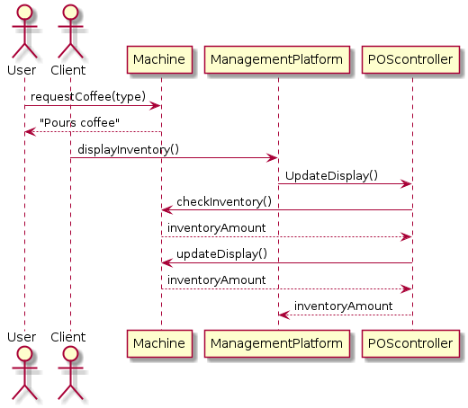
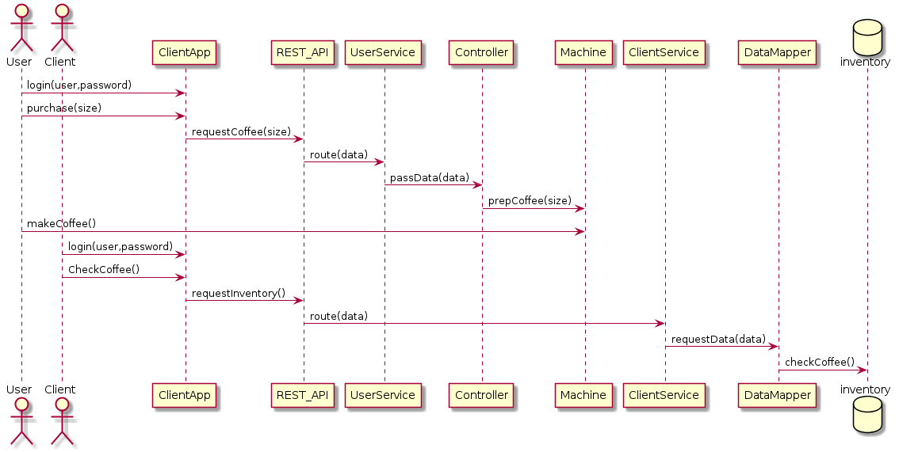

Design Review

Assessing Completeness : Design 1
Time Taken: 2 hours

Use Case 1 is the only use case addresses directly (mentioned on page 9), and a sequence
diagram is provided of how a user would interact with the machine. There are mentions of a 
data source in several diagrams, but the only diagram that mentions stock is on page 17. UC2,
UC3, and UC4 could possibly be satisfied by this diagram, since the product is connected to 
the client and supplier, but it isn't much. The design includes a Management platform which is
used by the clients to control permissions(UC5) and settings though it is unclear how.

Starting on page 14 the Quality attribute Scenarios are discussed individually. All have a
possible solution listed to adress the scenario.

One source they used discussed REST API Constraints, while the other 2 sources Domain models.
The model on page 17 resembles the inventory domain model they researched, but adapted to
coffee software.

The notebook rarely listed the pros and cons of ideas

The only information difficult to find was how some of the use cases were addressed.

Sunny Day Test : Design 1
Time Taken : 45 hour

First the user would request coffee from the machine, then the machine would make and pour the
coffee. Next the client would access the management platform and request the inventory status
which would then be displayed.

The preconditions are: The advanced controller is installed, the machine has enough inventory
to make coffee, the user has access to the machine, and there is currently cell service. The
post-conditions is that there is less inventory, the current inventory is displayed to the
client, and the user has coffee.

based on the provided diagram on page 18

Postconditions are satisfied

Rainy Day Test : Design 1
Time Taken : 10 minutes

QAS3 seems to be an issue. The scenario being that a new machine is added to the system, and
the client being able access and control the device within two minutes. The main concern is
that the diagram shown on page 17 shows no direct connection between the client and the machine
controller. It is not apparent how new machines are even added to the system.

Assessing Completeness : Design 2
Time Taken : 1 hour 20 minutes

All use cases are addressed. On pages 11-13 sequence diagrams are provided showing how the
system will operate under each use case.

The first entry addresses QAS1,2,3, and 5 by explaining how using a load-balancer and multiple
servers will be able to meet time requirements, and heavy loads. For QAS3, new machines will
be connected to a server.

QAS4 is also addressed under the first entry. The design states that the C language is being
used for the controllers which should allow for sudden disconnections from the server, and the
ability to re-sync with the server since it can more directly interact with memory.

The notebook pulled from multiple different sources. The author researched REST API, different
programming languages, statelessness, and a java security API.

The notebook justified all their ideas, stating the benefits of each idea, and what negatives
of an idea caused them to choose something else.

All the information was convient to find, the most useful information was summarized in a 
table at the end of each entry.

Sunny Day Test : Design 2
Time Taken : 30 minutes

The user will log into the client app and then purchase coffe. Next the user activates the
machine to make coffee and the user picks up their order. The client logs into the client app
and then requests the inventory of a machine, which is then displayed.

The preconditions are: The simple controller is installed, the machine has enough inventory to
make coffee, the user has access to the machine. The post-conditions is that there is less
inventory, the current inventory is displayed to the client, and the user has coffee.

based on the diagrams on page 11

Postconditions are satisfied

Rainy Day Test : Design 2
Time Taken : 30 minutes

Testing QAS4 and 5. Scenario- The cell service is down during the morning rush for coffee.
If cell service is down for an extended period of time the controller may lose data if it
doesn't have enough memory, though this is a concern for any design. The main concern is that
both the user and client use a mobile app to access the machine. Without cell service the
system may not function.

Conclusion
Time Taken : 10 minutes

The second design is better. First, it is easier to read and understsnd, so implementing it
would be easier. Second it is clearer about how and why each use case and quality attribute
scenario is satisfied by the design. The design also discusses how the software will
communicate with the databases. More details about the design are provided in the second
notebook. It is also unclear how the first design will satisfy all the use cases.

Reflection
Time Taken : 10 minutes

For notebook 1 it would have been easier to review if it was made clear about which drivers
were covered in each iteration. Only the QAS's were clearly covered.